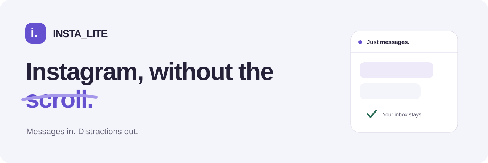
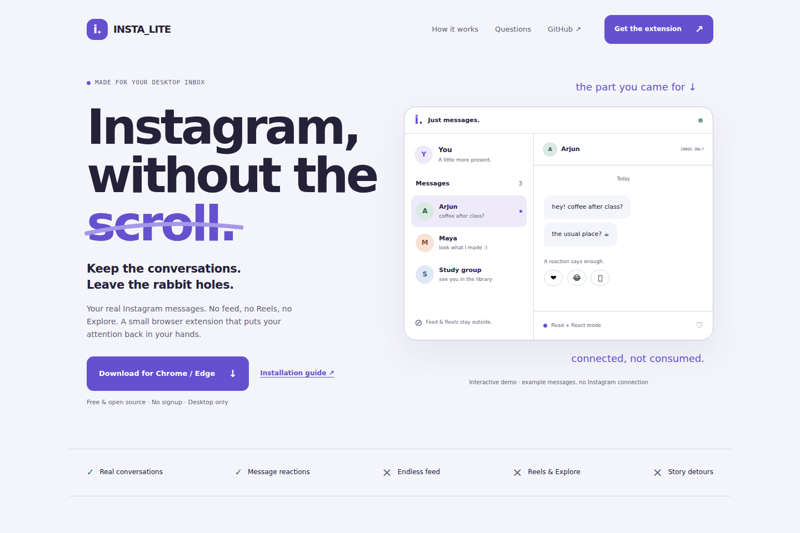
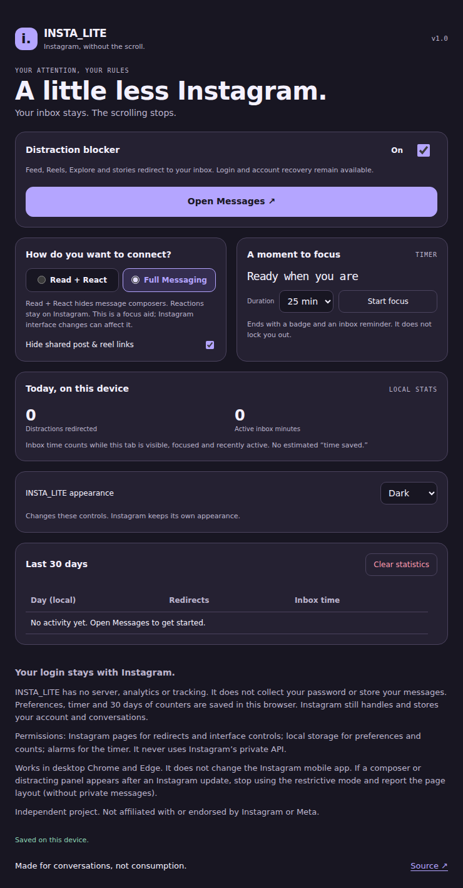

<p align="center">
  
</p>

<p align="center">
  <a href="https://github.com/Rishikeshsanin/INSTA_LITE/actions/workflows/ci.yml"></a>
  <a href="CHANGELOG.md"></a>
  <a href="LICENSE"></a>
  
  
</p>

<p align="center">
  <a href="https://raw.githubusercontent.com/Rishikeshsanin/INSTA_LITE/main/website/downloads/INSTA_LITE-extension-v1.0.0.zip"><strong>Download extension</strong></a> ·
  <a href="docs/INSTALLATION.md">Installation guide</a> ·
  <a href="docs/ARCHITECTURE.md">Architecture</a> ·
  <a href="docs/VERIFICATION.md">Verification</a> ·
  <a href="CONTRIBUTING.md">Contribute</a>
</p>

**Keep the conversations. Leave the rabbit holes.** INSTA_LITE is a desktop Chrome/Edge extension that keeps Instagram's native inbox while redirecting feed, Reels, Explore, stories, posts and profile detours back to messages.

Your login stays on Instagram. Settings and counters stay in your browser. There is no extension account, conversation database, analytics service or private Instagram API.

> **V1 is an installable preview.** Automated checks cover logic, mock Chrome APIs and fictional Instagram DOM fixtures. Live-account compatibility is still pending. Read + React is a focus aid, not a security boundary; Instagram layout changes can affect it. No extension-store listing exists yet.

## A quieter way to stay connected



_The companion website is a guide, demo and download page. The real inbox remains on Instagram._

| Keep                                      | Leave outside                        |
| ----------------------------------------- | ------------------------------------ |
| Native conversations and search           | Infinite feed                        |
| Native message reactions                  | Reels and Explore                    |
| Replies and attachments in Full Messaging | Stories, posts and profile detours   |
| Login, two-factor and recovery            | An extra account or message database |

## Install in a few clicks

**No coding or build commands required.** Use desktop Chrome or Edge.

1. [Download the extension ZIP](https://raw.githubusercontent.com/Rishikeshsanin/INSTA_LITE/main/website/downloads/INSTA_LITE-extension-v1.0.0.zip) and extract it into a permanent folder.
2. Open `chrome://extensions` or `edge://extensions`.
3. Enable **Developer mode** → **Load unpacked**.
4. Select the extracted folder containing `manifest.json`.
5. Pin INSTA_LITE → **Open Messages** → sign in directly on Instagram.
6. Refresh any Instagram tabs that were already open.

Keep the extracted folder in place. For updates, troubleshooting and removal, see the [complete installation guide](docs/INSTALLATION.md).

## Small controls, clear intention

| Feature                | What it does                                                                                                       |
| ---------------------- | ------------------------------------------------------------------------------------------------------------------ |
| Inbox-first navigation | Redirects distracting Instagram page visits to Direct.                                                             |
| Read + React           | Default mode: hides recognized composers and blocks common send controls while leaving native reactions available. |
| Full Messaging         | Restores normal messaging controls while keeping distracting routes blocked.                                       |
| Shared-content control | Hides recognized Instagram post/reel links by default. Inline previews can vary.                                   |
| Focus timer            | Persistent 15/25/45-minute timer with a badge and inbox reminder. No lockout.                                      |
| Honest activity counts | Actual redirected visits and observed active inbox minutes, with 30 local calendar days of history.                |
| Local preferences      | No signup, no server, no telemetry. Light/dark/system appearance for extension controls.                           |
| One-switch exit        | Turn the blocker off to restore normal browsing without logging out.                                               |

<details>
<summary><strong>See the extension settings</strong></summary>



_Settings screenshot uses mocked extension APIs and no account data._

</details>

## Privacy by scope

INSTA_LITE does not collect your password, request cookies access, copy message bodies or transmit conversation data. It stores preferences, timer state and daily counters in `chrome.storage.local`. Instagram continues to handle your account and conversations under its own policies.

Permissions are limited to `storage`, `declarativeNetRequest`, `alarms`, and the two Instagram HTTPS origins. See [the permission map](docs/ARCHITECTURE.md#permissions), [privacy page](website/privacy.html), and [security guidance](SECURITY.md).

## Build and contribute

Node.js **22 or 24** and npm. The installed extension and website have **no runtime package dependencies**; development checks use pinned tooling.

```sh
git clone https://github.com/Rishikeshsanin/INSTA_LITE.git
cd INSTA_LITE
npm ci
npm run verify
npm run dev
```

Open `http://localhost:4173`. Load `extension/` directly while developing. After extension changes, reload its browser card and refresh Instagram.

| Command                                   | Purpose                                                                |
| ----------------------------------------- | ---------------------------------------------------------------------- |
| `npm run format` / `npm run format:check` | Format source / check formatting.                                      |
| `npm test`                                | Route policy, authorization, counters, settings and timer tests.       |
| `npm run check`                           | Syntax, JSON, manifest references, permissions and telemetry checks.   |
| `npm run build`                           | Icons, shared CSS, extension/source/website ZIPs and static output.    |
| `npm run verify:packages`                 | ZIP integrity, package contents and source-archive privacy boundaries. |
| `npm run verify`                          | Run checks, unit tests, build and package verification.                |
| `npm run test:browser`                    | Browser workflows and synthetic Instagram DOM fixtures.                |

Browser setup, Windows commands and contribution conventions are in [CONTRIBUTING.md](CONTRIBUTING.md).

## What is verified?

| Evidence                | Scope                                                                                                                       |
| ----------------------- | --------------------------------------------------------------------------------------------------------------------------- |
| Logic tests             | Route parity, sender/origin checks, settings, timer lifecycle and concurrent counters with mocked APIs.                     |
| Browser checks          | Website/demo/downloads, settings, keyboard/error states and fictional Instagram DOM fixtures.                               |
| Automated accessibility | axe WCAG A/AA checks for the tested website, privacy and settings surfaces.                                                 |
| Packaging               | ZIP integrity, referenced extension files and exclusions for local/private files.                                           |
| Live Instagram          | **Pending.** Actual installation, browser redirect enforcement and native account layouts still require acceptance testing. |

The CI badge reports GitHub runs; local results are documented separately in [VERIFICATION.md](docs/VERIFICATION.md). Fixture results do not establish live-account compatibility. Before sharing widely, complete [ACCEPTANCE.md](docs/ACCEPTANCE.md).

## Repository map

| Path         | Purpose                                                                             |
| ------------ | ----------------------------------------------------------------------------------- |
| `extension/` | Manifest V3 extension: service worker, content controls, popup/settings and policy. |
| `website/`   | Companion website, fictional demo, privacy page and direct downloads.               |
| `tests/`     | Logic tests and browser fixtures.                                                   |
| `scripts/`   | Build, serve, source checks and ZIP verification.                                   |
| `docs/`      | Installation, architecture, acceptance, verification and release notes.             |
| `.github/`   | CI, preview-release workflow, issue forms and PR template.                          |

Visual and behavioral decisions live in [DESIGN.md](DESIGN.md), [PRODUCT.md](PRODUCT.md), and [UX-CONTRACT.md](UX-CONTRACT.md).

## Host the companion website

Import this repository into Vercel. `vercel.json` supplies the build command (`npm run build`), output directory (`website`) and security headers. Framework: **Other**. Root: repository root. No environment variables are required.

The static website can also be served by another static host. Hosting the companion website does not move or replicate the user's Instagram messages.

## Known limits

- Desktop website only; does not modify the Instagram mobile app.
- Composer, Notes and shared-link hiding depend on Instagram's markup and language.
- Regular image/video DM attachments and some inline shared-content previews may remain visible.
- Read + React does not guarantee that every new sending method is blocked.
- Extension-store publication and broad live-account testing are separate, unfinished steps.

Found a layout issue? [Open a compatibility report](https://github.com/Rishikeshsanin/INSTA_LITE/issues/new/choose) without credentials or private messages. Contributions are welcome; see [CONTRIBUTING.md](CONTRIBUTING.md).

---

Created by [Rishikesh Munnaluri](https://github.com/Rishikeshsanin). [MIT licensed](LICENSE). Independent project; not affiliated with or endorsed by Instagram or Meta.
