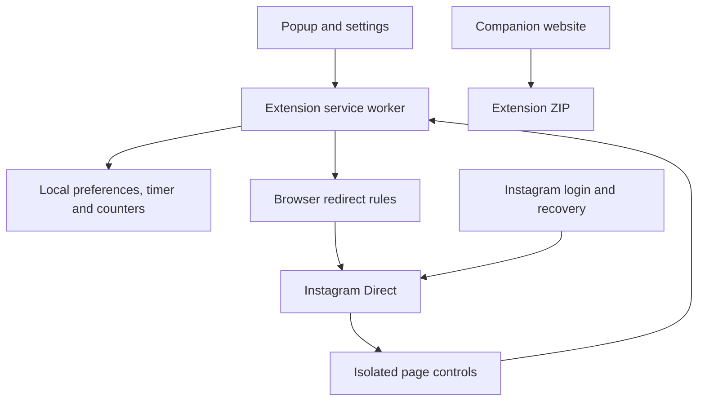

# Architecture

INSTA_LITE changes navigation and UI locally. Instagram owns authentication, conversation storage and messaging actions. There is no custom messaging backend or private API.

## Responsibilities

| File                      | Owns                                                                                             |
| ------------------------- | ------------------------------------------------------------------------------------------------ |
| `extension/core.js`       | Defaults, normalization, URL allowlist, origin validation and counter retention.                 |
| `extension/rules.json`    | Main-frame redirects, with higher-priority login/Direct exceptions.                              |
| `extension/background.js` | Serialized storage writes, sender checks, ruleset settings, timer alarms and badge.              |
| `extension/content.js`    | SPA route guard, recognized navigation/composer hiding, focus pill and bounded activity reports. |
| `extension/content.css`   | Scoped CSS augmentation; turning the blocker off restores the native interface.                  |
| `extension/ui.js`         | Shared popup/options behaviors, local save feedback and failure rollback.                        |
| `extension/ui.css`        | Visual tokens and common control styles; copied to `website/tokens.css` during builds.           |
| `website/`                | Fictional demo, installation, privacy and versioned download links.                              |
| `scripts/build.mjs`       | Deterministic icons and ZIP packaging; static deployment output.                                 |

## Data boundary

Persisted state contains preferences, timer deadline and daily `{blocked, seconds}` counters. It does not contain message bodies, usernames, conversation exports, passwords or cookies. Counters use local calendar dates, retained for 30 days. Active inbox seconds count only while Direct is visible, focused and recently active.

The service worker validates the sender. Extension pages may read or change settings. Instagram content scripts can only submit bounded counter events or request the settings page. Storage operations are serialized so concurrent heartbeat events do not drop increments.

Read + React is enforced through recognized DOM controls. It is a convenience for attention management; it must not be used as a security or parental-control boundary. Full Messaging removes the composer restriction while preserving distraction blocking.

## Permissions

| Permission                                                  | Purpose                                        | Boundary                                                       |
| ----------------------------------------------------------- | ---------------------------------------------- | -------------------------------------------------------------- |
| `storage`                                                   | Local preferences, timer and counters.         | No conversation storage or sync.                               |
| `declarativeNetRequest`                                     | Redirect distracting main-frame visits.        | No API interception or message modification.                   |
| `alarms`                                                    | Persistent timer completion and badge refresh. | No timed messaging actions.                                    |
| `https://instagram.com/*` and `https://www.instagram.com/*` | Redirects and local page changes.              | No all-sites access, cookies permission or external endpoints. |

## Verification levels

1. Policy/unit checks cover route parity, origin/sender validation, settings, counters and alarms with mock APIs.
2. Browser checks cover the companion site, control states and fictional Instagram DOM fixtures.
3. Real-account checks verify current native Instagram markup, actual installation/DNR enforcement, search and reactions.

Levels 1 and 2 have recorded local evidence. Level 3 remains pending; see [VERIFICATION.md](VERIFICATION.md) and [ACCEPTANCE.md](ACCEPTANCE.md).
